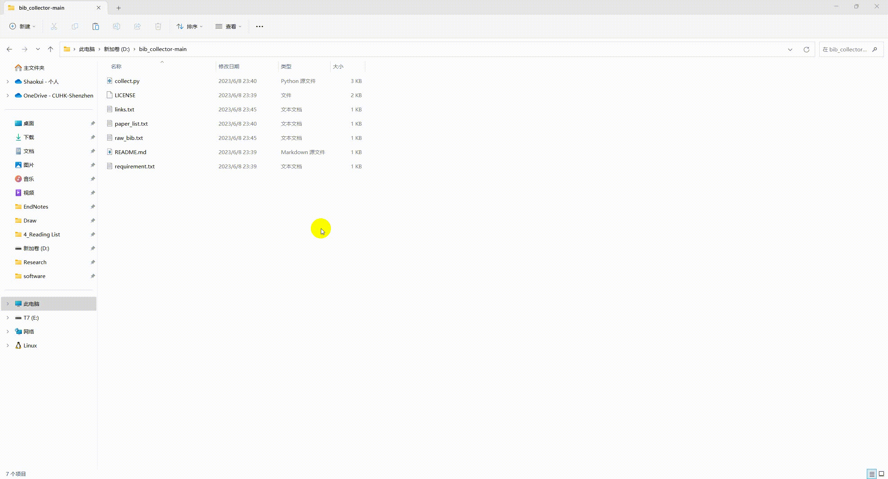

## Bib Collector
#### A simple python program to collect BibTeX info from Google Scholar.

1. Install selenium
>> pip install selenium==4.9.1 
2. Install Chrome/Chromium and Chrome driver
    * Install Chrome or Chromium
    * Check your Chrome/Chromium version, e.g., enter ”chrome://version/“ in the address line
    * Install the corresponding driver from http://chromedriver.storage.googleapis.com/index.html to your_customized_driver_path

3. Modify settings in collect.py:

    >> input_file = 'paper_list.txt'
    
    >> output_file = 'links.txt'
    
    >> output_bib_file = 'bib.txt'
    
    >> chromedriver_path = "your_customized_driver_path"

4. Run in terminal
    * Add the paper titles to input_file line by line.
    * Run the following code:
    >> python collect.py

5. Exception
   * After some running, the program may be interrupted by Google. Run the following line to continue to collect from line xxx
   >> python collect.py xxx

6. Demo:
    

* Other recommend resources
    * Rebiber: A tool for normalizing bibtex with official info: https://github.com/yuchenlin/rebiber